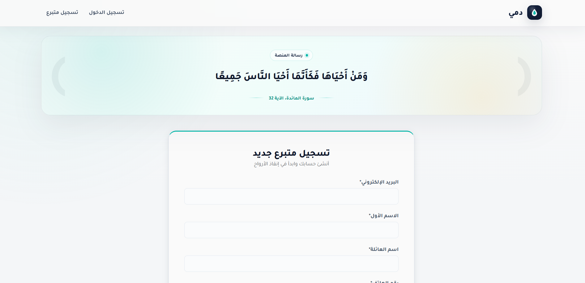
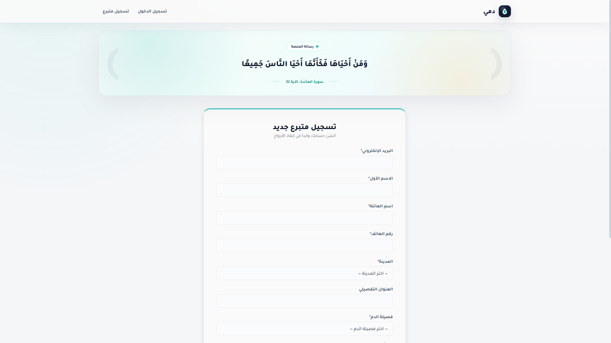
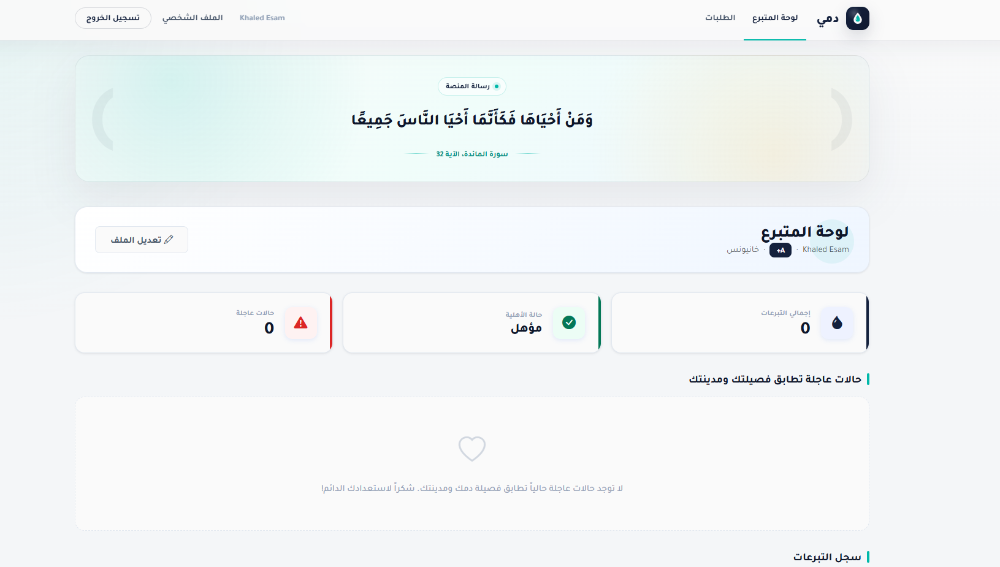
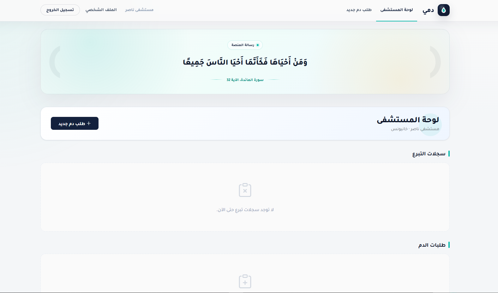

# Dami — Centralized Blood Donation Management Platform

Dami is a centralized blood donation management platform that connects hospitals and blood banks directly with eligible donors. It replaces the unstructured, ad-hoc blood requests circulating on social media with a secure, targeted alert system. When a hospital opens an urgent blood request, Dami automatically notifies only the donors whose blood type and city match the request — protecting patient privacy while ensuring the right donors are reached at the right time.

**Live demo:** [dami2.pythonanywhere.com](https://dami2.pythonanywhere.com)

---

## Screenshots

### Login & Registration

### Donor Dashboard

### Hospital Dashboard

---

## Key Features

- **Smart Targeted Alerts:** Centralized matching by blood type and city ensures donors only see requests relevant to them.
- **Email Notifications:** Eligible donors are automatically notified by email when a matching urgent request is opened, with a one-click opt-out from their profile.
- **Request Management:** Hospitals can create, edit, and track urgent blood requests with live progress tracking toward the required quantity of blood bags.
- **Health-Safety Enforcement:** Donor health profiles automatically track total donations and enforce a mandatory 90-day waiting period between donations to ensure compliance with health rules.
- **Privacy Protection:** Patient names remain hidden from donors and are visible only to the authorized hospital staff that created the request.
- **Role-Based Access Control:** Separate, secure login portals and distinct permissions for donors, hospitals, and platform administrators.
- **Real-Time AJAX Actions:** Donors can commit to a request and hospital staff can confirm donation completion instantly without page reloads.
- **Email Verification:** New accounts require email verification before activation.

---

## System Workflow

### Donor Flow

1. **Registration:** Donors register by providing their blood type, city, and contact details. An email verification link is sent before the account is activated.
2. **Dashboard Overview:** Displays active requests matching the donor's profile, total donation counts, and real-time eligibility status.
3. **Commitment:** Donors click "I'm coming to donate" to commit to a specific open request. This action triggers an immediate update to the hospital's received-bags counter via AJAX without reloads.

### Hospital Flow

1. **Account Verification:** Hospitals register and verify their accounts to secure platform legitimacy.
2. **Request Management:** Authorized staff open blood requests specifying the target blood type, quantity of bags required, and the specific branch address.
3. **Confirmation and Automation:** Lab staff confirm sample collection with a single click. This automatically updates the donor's eligibility status, increments the request's fulfillment count, and closes the request once the target quantity is met.

---

## Technical Specifications

- **Backend Framework:** Django (Python) — routing, data validation, and business logic.
- **Database:** SQLite (development) / upgradeable to PostgreSQL or MySQL.
- **Frontend UI:** Bootstrap 5, Bootstrap Icons, vanilla JavaScript.
- **Email Service:** Brevo transactional email API (works on PythonAnywhere free tier).
- **Asynchronous Integration:** Native AJAX handles seamless status transitions for donor commitment and staff confirmations.
- **Security:** Encrypted password storage, CSRF token validation, signed email tokens, and strict role-based access control.

---

## Database Architecture (ERD Summary)

The relational schema consists of five core entities structured to optimize data isolation and operational performance:

### Core Entities

- **User:** Central authentication profile — email, encrypted password, role (donor / hospital / admin), phone number, city, address, and blood type.
- **HospitalProfile:** Extends User for hospital accounts — hospital name, license number, and verification status.
- **DonorProfile:** Tracks donor statistics — last donation date, total donation count, computed availability status, and email notification preference.
- **BloodRequest:** Logs active hospital requests — blood type needed, bags required, bags received, branch address, status, and timestamps.
- **DonationRecord:** Records individual donation attempts, managing states from initial commitment to final completion.

### Entity Relationships

- **User → HospitalProfile / DonorProfile:** `1:1` — general account mapped to a functional profile.
- **HospitalProfile → BloodRequest:** `1:N` — a hospital can open multiple requests over time.
- **BloodRequest → DonationRecord:** `1:N` — multiple donor commitments under one request.
- **DonorProfile → DonationRecord:** `1:N` — full donation history for each donor.

---

Made with ❤ by Khaled Alabadla
